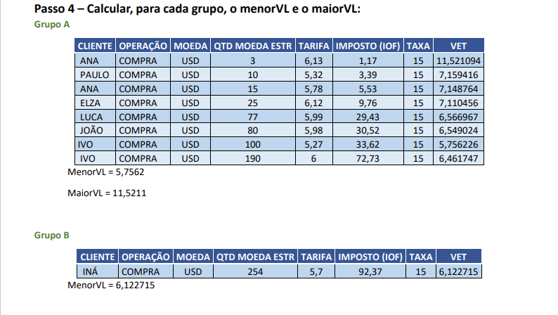
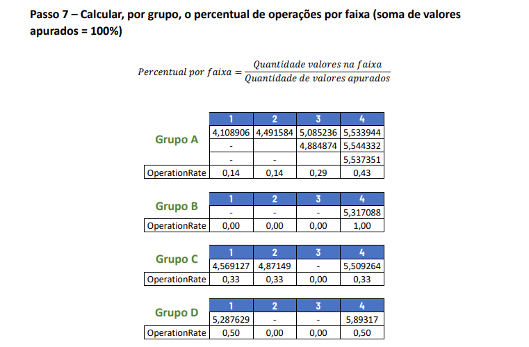

[Link para página original no Confluence](https://openfinancebrasil.atlassian.net/wiki/spaces/OF/pages/17367790)

Estas APIs disponíveis visam exibir e compartilhar dados não sensíveis de instituições participantes do [Open Finance Brasil](https://openfinancebrasil.org.br/), disponibilizando ao público informações sobre os seus canais de atendimento e as características de produtos e serviços bancários tradicionais que oferecem.

## **Guia de implementação**

Acesse neste [*link*](https://github.com/OpenBanking-Brasil/mock-api) uma implementação de referência da Fase 1.

Esta implementação de exemplo permite ao desenvolvedor realizar testes referentes à Fase 1 (*open-data*) do Open Finance Brasil.

## **Divulgação dos valores de tarifas e taxas de juros remuneratórios**

Conforme disposto na [Circular nº 4.015](https://www.bcb.gov.br/pre/normativos/busca/downloadNormativo.asp?arquivo=/Lists/Normativos/Attachments/51025/Circ_4015_v1_O.pdf), art. 3º, para fins de compartilhamento dos valores de tarifas e taxas de juros remuneratórias dos produtos e serviços ofertados, as instituições devem compartilhar uma distribuição de frequência relativa dos valores cobrados e dos clientes.

Segundo o Art. 6º da [Instrução Normativa nº 32 BCB](https://www.in.gov.br/en/web/dou/-/instrucao-normativa-bcb-n-32-de-26-de-outubro-de-2020-285238448), de 2020: “O compartilhamento da distribuição de frequência relativa dos valores de tarifas e taxas de juros cobrados dos clientes, de que trata o § 2º do art. 3º da Circular nº 4.015, de 2020, deve dar-se com base em quatro faixas de igual tamanho, com explicitação dos valores sobre a mediana e o percentual de clientes em cada uma dessas faixas, além dos valores máximos e mínimos do universo, segmentados em pessoas naturais e jurídicas, bem como por tipo de serviço ou modalidade de operação e por indexador ou referencial, no caso de operações pós-fixadas.

§ 1º Admite-se que as instituições compartilhem dados relacionados à distribuição de frequência de que trata o caput em base atualizada em periodicidade mensal, divulgada no décimo dia útil de cada mês, a partir de janeiro de 2021, referente a valores cobrados de seus clientes no mês anterior.

§ 2º A distribuição de frequência relativa a taxas de juros divulgada conforme o § 1º deve corresponder às operações de crédito concedidas no mês anterior”.

Dessa forma, cada instituição deve, no momento de compartilhamento, ordenar sua base em ordem crescente de valores cobrados por tarifas e taxas de juros remuneratórias dos produtos e serviços ofertados durante o mês de apuração, segmentá-la em quatro faixas de mesmo valor e divulgar 10 valores:

- Valores: máximo e mínimo do universo de clientes (i.e. 2 valores);
- Mediana de cada faixa (i.e. 4 valores);
- Percentual de clientes em cada faixa (i.e. 4 valores).

Devem ser utilizados no cálculo os valores devidos de tarifas e os valores cobrados de taxas de juros remuneratórias disponíveis nas bases de cliente no mês anterior.

Caso haja mais de 1 evento por cliente referente ao mesmo produto e/ou serviço, deverá ser considerado apenas 1 valor, calculado como a média aritmética dos valores das ocorrências daquele cliente.

Para taxas de juros remuneratórias, os valores compartilhados/divulgados serão os que correspondem às concessões no mês da apuração, segmentados em pessoas naturais e jurídicas, bem como por modalidade de operação e por indexador ou referencial, no caso de operações pós-fixadas.

Para tarifas, a segmentação é por pessoas naturais e jurídicas e por tipo de serviço referente a tarifa avulsa (fora do Pacote de Serviço) cobradas no mês de apuração, devendo-se considerar inclusive as de valor zero (ou isentas).

## **Tarifas – Apuração frequência e valores correspondentes**

**Serviço:** tarifas avulsas cobradas no mês de apuração. (Cada tarifa será informada separadamente, devendo ser informadas tantas tarifas quanto as que satisfizerem os critérios de apuração). As tarifas de valor zero (ou isentas) fora de pacotes de serviços, caso tenham ocorrido no mês de referência, devem ser consideradas na distribuição de frequência relativa dos valores.

**Tipo Pessoa:** PN ou PJ

**Período:** mês fechado, identificado como M-1

**Base Clientes:** clientes segregados por tipo de pessoa que tiveram cobrança da mesma tarifa avulsa (não inclusa no pacote de serviços) no mês de apuração. Caso haja mais de 1 evento por cliente, referente ao mesmo produto e/ou serviço, deverá ser considerado apenas 1 valor, calculado como a média aritmética dos valores das ocorrências daquele cliente.

### **Processo de apuração para cada tipo de tarifa que satisfizer critérios de apuração:**

1. Identificar clientes com mais de uma ocorrência de evento e calcular a média aritmética sobre valores cobrados;
2. Enfileirar os valores em ordem crescente de grandeza;
3. Definir menor (MenorVL) e maior valor (MaiorVL) relativos às tarifas enfileiradas em ordem crescente;
4. Definir: (MaiorVL – MenorVL ) / 4 = Intervalo para definição faixas de valores (e se MenorVL = MaiorVL, então (MaiorVL – 0) / 4;
5. Calcular a mediana dos valores em cada faixa;
6. Calcular o percentual de clientes por faixa (soma dos valores apurados = 100%).

### **Exemplo de uso:**

- Tarifas – Apuração Frequência e valores correspondentes

- Tarifas – Distribuição de Frequência

## **Apuração Frequência Taxas Juros remuneratórios**

**Modalidade:** relativa às operações de crédito concedidas (contratadas) no mês da apuração (M-1 – mês anterior)

**Tipo Pessoa:** PN ou PJ

**Taxa ou Indexador:** referente ao custo da operação contratada e percentual de incidência (conforme Anexo 5: Taxa referencial ou Indexador (Indx), do Documento 3040, BCB) – Dado informativo

**Período:** mês fechado, identificado como M-1

**Base Clientes:** clientes segregados por tipo de pessoa (contrato) que tomou crédito de mesma Modalidade no mês de apuração. Com mesmo tipo de taxa ou Indexador e mesmo percentual aplicado. Caso haja mais de 1 evento por cliente referente a mesma Modalidade e Indexador deverá ser considerado apenas 1 valor, calculado como a média aritmética dos valores das ocorrências daquele cliente

**Processo de Apuração para cada tipo de Indexador/taxa – percentual aplicado para cada Modalidade que satisfizer os critérios de apuração**

Para cada Indexador/Taxa e seu percentual, da Modalidade apurada:

1. Identificar clientes com mais de uma ocorrência de evento e calcular a média aritmética sobre valores cobrados;
2. Enfileirar os valores em ordem crescente de grandeza;
3. Definir menor (MenorVL) e maior valor (MaiorVL) relativos aos valores enfileirados em ordem crescente
4. Calcular: ( MaiorVL – MenorVL ) / 4 = Intervalo para definição faixas de valores (e se MenorVL = MaiorVL, então 1. (MaiorVL – 0) / 4
5. Calcular mediana dos valores em cada faixa
6. Calcular o percentual de clientes por faixa ( soma dos valores apurados = 100% )

**Exemplos de Uso:**

- Taxas Remuneratórias – Apuração Frequência e valores correspondentes 1

- Taxas Remuneratórias – Apuração Frequência e valores correspondentes 2

- Distribuição de Frequência

- Distribuição de Frequência Convenções

- Taxas Remuneratórias – Distribuição de Frequência

## Apuração Frequência Taxas de Operações de Investimento

**Modalidade:** relativa às operações de investimento no mês da apuração (M-1 – mês anterior)

**Tipo Pessoa:** PN ou PJ

**Taxa ou Indexador: **referente às aplicações feitas pelos clientes e percentual de incidência (conforme Anexo 5: Taxa referencial ou Indexador (Indx), do Documento 3040, BCB) – Dado 

informativo

**Período: **mês fechado, identificado como M-1

**Base de Operações: **operações segregadas por tipo de pessoa (contrato) que realizou Investimento de mesma Modalidade no mês de apuração. Com o mesmo tipo de taxa ou 

Indexador. Todas as operações devem ser consideradas, mesmo que haja mais de 1 operação por cliente referente a mesma Modalidade e Indexador.

### **Processo de apuração das taxas de operação (Investimento):**

1. Identificar eventos de operação na base;
2. Enfileirar os valores em ordem crescente de grandeza

    - Para operações com indexador CDI, DI, SELIC: considerar ERATE = RATE, desconsiderando SPREAD mas considerando a operação
    - Para demais indexadores: considerar ERATE = SPREAD, para operações cujo RATE = 100%. Operações com RATE diferente de 100% deverão ser desconsideradas
3. Definir menor (MenorVL) e maior valor (MaiorVL) relativos às operações enfileiradas em ordem crescente;
4. Definir: (MaiorVL – MenorVL ) / 4 = Intervalo para definição faixas de valores (e se MenorVL = MaiorVL, então (MaiorVL – 0) / 4;
5. Calcular a mediana dos valores em cada faixa;
6. Calcular o percentual de operações por faixa, considerando a quantidade de valores em cada faixa. A soma dos percentuais das 4 faixas deve ser = 100%

**Exemplos de Uso: **

## Apuração Frequência Taxas de Operações de Câmbio

**Modalidade:** relativa às operações de câmbio no mês da apuração (M-1 – mês anterior)

**Tipo Pessoa:** PN ou PJ

**Taxa ou Indexador: **referente às operações de câmbio feitas pelos clientes e percentual de incidência (conforme Anexo 5: Taxa referencial ou Indexador (Indx), do Documento 3040, 

BCB) – Dado informativo

**Período:** mês fechado, identificado como M-1

**Base de Operações:** operações segregadas por tipo de pessoa (contrato) que realizou Câmbio de mesma Modalidade (moeda) no mês de apuração. Com o mesmo tipo de taxa ou 

Indexador e Moeda. Todas as operações devem ser consideradas, mesmo que haja mais de 1 operação por cliente referente a mesma Modalidade (Moeda) e Indexador.

### Processo de apuração das taxas de operação (Câmbio):

1. Identificar eventos de operação na base;
2. Enfileirar os valores em ordem crescente de grandeza;
3. Classificar cada operação em um dos 7 grupos de acordo com a quantidade de moeda estrangeira, desconsiderando operações com VET negativo.
4. Definir, para cada grupo, menor (MenorVL) e maior valor (MaiorVL) relativos às operações enfileiradas em ordem crescente;
5. Definir, para cada grupo, (MaiorVL – MenorVL ) / 4 = Intervalo para definição faixas de valores. Se MenorVL = MaiorVL, então (MaiorVL – 0) / 4;
6. Calcular, para cada grupo, a mediana dos valores em cada uma das 4 faixas;
7. Calcular, para cada faixa de cada grupo, o percentual de operações por faixa, considerando a quantidade de valores em cada faixa. A soma dos percentuais das 4 faixas, por grupo,

deve ser = 100%

**Exemplos de Uso:**

[Link para página original no Confluence](https://openfinancebrasil.atlassian.net/wiki/spaces/OF/pages/17367790)