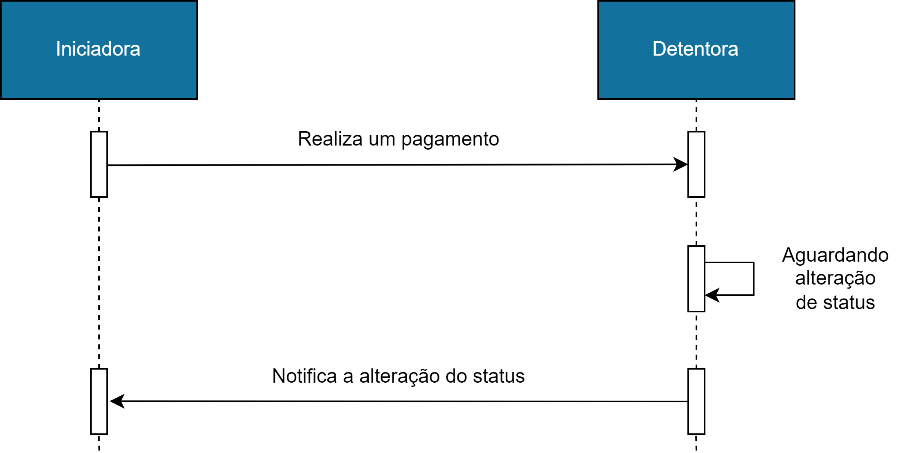

[Link para página original no Confluence](https://openfinancebrasil.atlassian.net/wiki/spaces/OF/pages/200736786)

## O que é?

Um **webhook **é um **mecanismo **que **permite **que **aplicativos** ou **serviços **se **comuniquem de forma assíncrona**, enviando informações em **tempo real** de um aplicativo para outro. É uma forma de integração entre sistemas, onde um aplicativo pode notificar outro sobre eventos ou atualizações ocorridas.

O **conceito **básico do **webhook **envolve a definição de um ponto de extremidade (URL) em um aplicativo receptor, que fica **esperando por solicitações de notificação**. Quando ocorre um evento relevante no aplicativo remetente, ele **envia automaticamente uma solicitação HTTP POST** para o webhook do aplicativo **receptor**, contendo os dados relevantes do evento.

## Por que será utilizado?

No contexto **OpenFinance**, utilizando o exemplo da API de Pagamentos, que utiliza como retorno o **polling**, ou seja, **sempre que a Iniciadora** realiza um **pagamento**, é necessário que seja **realizado consultas (GET) **em **intervalos pré-definidos na Detentora**, para identificar o **status do pagamento.**

O **consumo** de informações pelos participantes do Open Finance é feito através de diversas consultas (**polling**), onde um participante busca avaliar se **houve alguma atualização no estado de um recurso,** dessa maneira eleva-se de forma significativa o **consumo da infraestrutura** das instituições participantes do Open Finance.

Pensando na **evolução **do **ecossistema**, foi proposto a **implementação **de uma** tecnologia assíncrona** que pudesse **reduzir a quantidade de polling** que é realizado, **reduzindo os custos operacionais** entre as instituições.

## Usabilidade

A **usabilidade **de um **webhook** é **bastante ampla e flexível**, e pode variar de acordo com a **finalidade **e contexto **de uso**. Aqui estão alguns exemplos comuns de **casos de uso** para webhooks:

1. **Integração de sistemas**: Webhooks são frequentemente usados para integrar diferentes sistemas e serviços, permitindo a troca de informações em tempo real. Por exemplo, um sistema de comércio eletrônico pode usar webhooks para notificar automaticamente um sistema de gerenciamento de estoque sempre que um produto for vendido, para que o estoque seja atualizado imediatamente.
2. **Monitoramento de eventos**: Webhooks também podem ser usados para monitorar eventos e receber notificações quando ocorrerem. Por exemplo, um sistema de monitoramento de servidores pode receber webhooks para alertar imediatamente a equipe de operações quando um servidor ficar offline.
3. **Integração com serviços de pagamento**: Um serviço de pagamento online pode usar webhooks para notificar automaticamente um sistema de gerenciamento financeiro sobre transações concluídas, permitindo a atualização imediata das informações de contabilidade.
4. **Notificações em tempo real**: Plataformas de mensagens instantâneas ou redes sociais podem utilizar webhooks para enviar notificações em tempo real para um aplicativo externo sempre que uma nova mensagem for recebida.
5. **Atualização de status de envio**: Empresas de logística e entregas podem utilizar webhooks para fornecer atualizações em tempo real sobre o status de envio de pacotes, como mudanças de status (enviado, em trânsito, entregue), informações de rastreamento e horários estimados de entrega.

[Link para página original no Confluence](https://openfinancebrasil.atlassian.net/wiki/spaces/OF/pages/200736786)